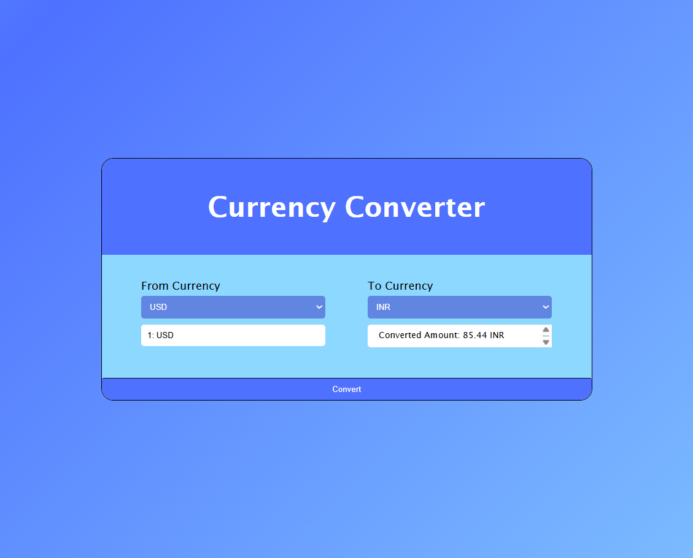

#  Currency Converter

A currency converter built using **HTML**, **CSS**, and **JavaScript**. This tool allows users to convert between different currencies with a clean user interface and simple logic.

---

##  Demo

  

---

##  Features

- Convert between two currencies
- Responsive and clean design
- Real-time or mock exchange rate support
- Easy to extend with more currencies
- Input validation included

---

##  Technologies Used

- **HTML** – for page structure
- **CSS** – for styling and layout
- **JavaScript** – for conversion logic and dynamic behavior

---

##  How to Use

1. **Clone** or **download** the repository.
2. Open the `index.html` file in your browser.
3. Enter an amount, choose source and target currencies, then click **Convert**.
4. View the converted result instantly.

---
## Future Improvements

1. Add real exchange rates from an API (e.g., ExchangeRate-API, Open Exchange Rates)
2. Support for more currencies
3. Better animations and transitions
4. Dark mode theme

